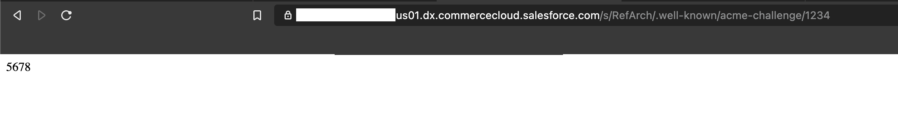

# plugin_wellknown: Storefront Reference Architecture (SFRA)

This is the repository for the plugin_wellknown plugin. This plugin allows for domain verification:

* Allow for validation of ownership of a domain using the .well-known folder

_Note: This is a POC project, so it is not finished and will not work for every project out of the box. It is simply a starting point._

# Demo


# Cartridge Path Considerations
The plugin_wellknown plugin requires the app\_storefront\_base cartridge. In your cartridge path, include the cartridges in the following order:

```
plugin_wellknown:app_storefront_base
```

# Getting Started

1. Clone this repository. (The name of the top-level folder is plugin_wellknown.)
2. In the top-level plugin_wellknown folder, enter the following command: `npm install`. (This command installs all of the package dependencies required for this plugin.)
3. In the top-level plugin_wellknown folder, edit the paths.base property in the package.json file. This property should contain a relative path to the local directory containing the Storefront Reference Architecture repository. For example:
```
"paths": {
    "base": "../storefront-reference-architecture/cartridges/app_storefront_base/"
}
```
4. In the top-level plugin_wellknown folder, enter the following command: `npm run uploadCartridge`

For information on Getting Started with SFRA, see [Get Started with SFRA](https://documentation.b2c.commercecloud.salesforce.com/DOC1/index.jsp?topic=%2Fcom.demandware.dochelp%2Fcontent%2Fb2c_commerce%2Ftopics%2Fsfra%2Fb2c_sfra_setup.html).

# Site preferences
This cartridge makes use of 2 site preferences:

1.`wellKnownFilename`: The ACME file name

2.`wellKnownValue`: The ACME file contents

These can be imported through the import function in the Business Manager to import System Object Types. You can find the file `system-object-types.xml` in the `metadata` folder.

# NPM scripts
Use the provided NPM scripts to compile and upload changes to your sandbox.

## Linting your code

`npm run lint` - Execute linting for all JavaScript and SCSS files in the project.

## Watching for changes and uploading

`npm run watch` - Watches everything and recompiles (if necessary) and uploads to the sandbox. Requires a valid dw.json file at the root that is configured for the sandbox to upload.
